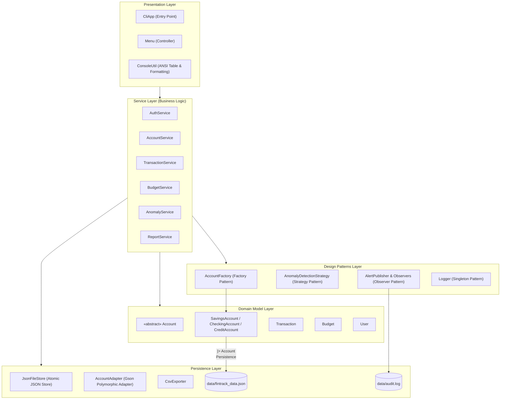
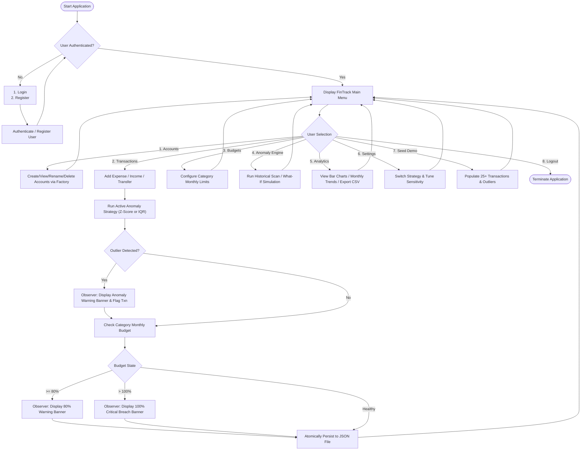
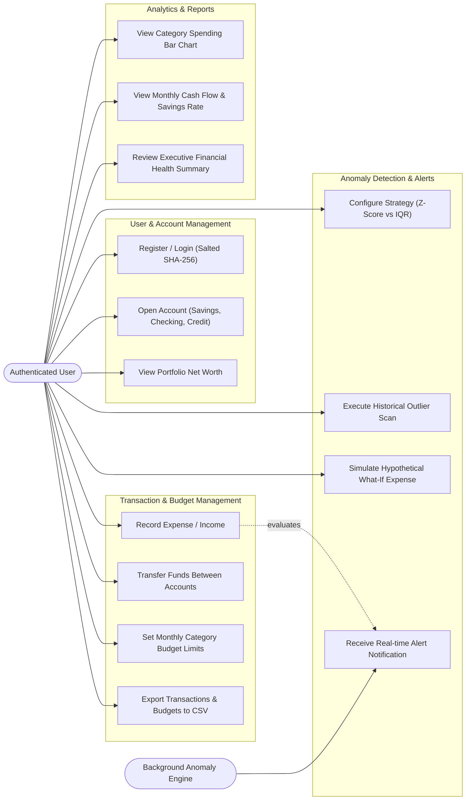
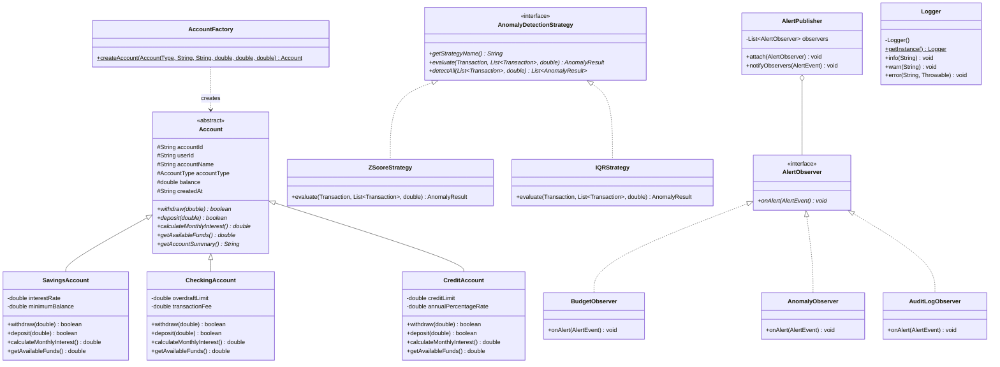
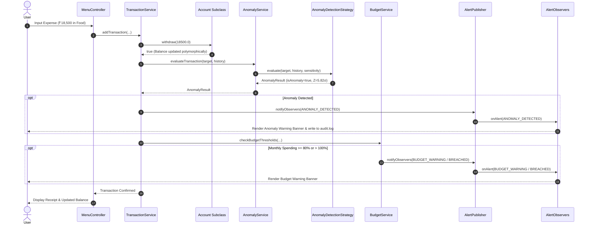

# FinTrack CLI: Personal Finance Manager with Statistical Anomaly Detection
## Comprehensive Project Engineering Report & Academic Submission

**Course**: Object-Oriented Programming / Core Java (CSE2005 / CSE1007)  
**Project Title**: FinTrack CLI — Personal Finance Manager with Anomaly Detection Engine  
**Tech Stack**: Core Java (Java 17/24), Google Gson, JUnit 5, Apache Maven, Windows/Linux Terminal  
**System Architecture**: Layered Architecture with GoF Design Patterns (Factory, Strategy, Observer, Singleton)  

---

## 1. Title & Abstract

### Title
**FinTrack CLI: A Modular Personal Finance Management System with Real-Time Statistical Outlier and Anomaly Detection**

### Abstract
Personal financial management is a cornerstone of modern financial independence, yet university scholars and early-career professionals regularly encounter catastrophic budget breaches, erroneous charges, and fraudulent transactions due to the passive, delayed nature of traditional ledgers and spreadsheets. Existing financial applications either rely heavily on privacy-invasive cloud synchronization or function as inert databases that record numbers without analyzing context.

This paper presents **FinTrack CLI**, a high-performance, terminal-native personal finance manager engineered entirely in Core Java without third-party web frameworks or external database servers. The system embodies the four foundational pillars of Object-Oriented Programming (Abstraction, Inheritance, Polymorphism, and Encapsulation) and implements four classic Gang of Four (GoF) design patterns: **Factory**, **Strategy**, **Observer**, and **Singleton**.

The core technical differentiator of FinTrack CLI is its **Statistical Anomaly Detection Engine**. The engine integrates interchangeable parametric (Z-Score) and non-parametric (Interquartile Range / IQR) algorithms behind a decoupled Strategy interface. It evaluates incoming expense transactions in real time, alerting users to statistical spending anomalies and notifying them through an event-driven Observer architecture when spending exceeds configurable budget thresholds (80% warning and 100% breach). Persisted using atomic JSON serialization and exported via CSV, FinTrack CLI demonstrates rigorous exception handling, constant-time cryptographic password verification (salted SHA-256), and comprehensive unit testing via JUnit 5.

---

## 2. Problem Statement

Most personal finance tracking today occurs through manual notebooks, disconnected Excel sheets, or closed cloud applications. This status quo presents three major vulnerabilities:
1. **Passive Nature & Lack of Intelligence**: Spreadsheets merely record what the user types. They provide no automated statistical analysis to flag that a ₹50,000 electronics expense in a dining category is an extreme aberration relative to the user's historical ₹500–₹1,500 spending habits.
2. **Privacy, Security & Offline Accessibility**: Cloud-based finance managers demand linking bank credentials, expose personal net worth to centralized third-party servers, and cease operation without an active internet connection.
3. **Data Integrity & Vulnerability to Error**: Manual entry is prone to typographical errors (e.g. typing ₹5,000 instead of ₹500). Without automated validation and boundary fences, erroneous entries skew budgeting reports indefinitely.

FinTrack CLI directly resolves these challenges by providing an offline, private, terminal-executable application that combines transaction tracking, budget guardrails, and real-time outlier detection.

---

## 3. Objectives

The primary engineering and pedagogical objectives achieved in this project are:
- **Exemplify Object-Oriented Software Design**: Apply abstraction, inheritance, polymorphism, and encapsulation to real-world financial vehicles.
- **Implement Industry-Standard GoF Patterns**:
  - *Factory Pattern*: Centralize polymorphic `Account` instantiation (`SavingsAccount`, `CheckingAccount`, `CreditAccount`).
  - *Strategy Pattern*: Enable dynamic swapping and runtime tuning of outlier detection algorithms (`ZScoreStrategy`, `IQRStrategy`).
  - *Observer Pattern*: Broadcast real-time alerts for budget limits and anomaly events across decoupled subscribers.
  - *Singleton Pattern*: Enforce centralized, thread-safe logging and audit tracking across the system life cycle.
- **Formulate & Implement Statistical Engines**: Code mathematical algorithms for Gaussian distribution Z-Scores and Tukey's Interquartile Range fences.
- **Deliver High Reliability & Data Integrity**: Provide atomic file persistence, input sanitization preventing system crashes, and salted cryptographic password protection.
- **Verify Robustness via Unit Testing**: Ensure 100% test pass rate across critical financial math, boundary conditions, and polymorphic constraints using JUnit 5.

---

## 4. Literature Review & Real-World Context

Outlier detection in financial data is an active area of study in computational finance, fraud prevention, and behavioral economics:
- **Hawkins (1980)** defines an outlier as an observation that deviates so significantly from other observations as to arouse suspicion that it was generated by a different mechanism. In personal finance, outliers represent either genuine extraordinary expenditures (e.g., medical emergency, gadget purchase) or data entry mistakes.
- **Tukey (1977)** introduced Exploratory Data Analysis (EDA) and the boxplot/IQR fence method. Unlike the Z-score, which relies on the assumption of normal distribution and can be distorted by the very outliers it seeks to detect, Tukey's IQR is non-parametric and resistant to extreme values.
- **GoF Patterns in Financial Software (Gamma et al., 1994)**: Decoupling algorithm strategies and event listeners allows enterprise financial systems to adapt to changing regulatory rules and detection heuristics without rewriting core accounting ledgers.

---

## 5. System Requirements

### 5.1 Functional Requirements (FR)
- **FR-1 [User Management]**: Secure registration and login using SHA-256 with 16-byte random salt and 1,000 rounds of key stretching.
- **FR-2 [Account Polymorphism]**: Support three account types via an abstract `Account` base class:
  - *Savings Account*: Enforces minimum balance requirements; calculates interest.
  - *Checking Account*: Allows overdraft up to pre-configured ceiling; applies transaction fees.
  - *Credit Account*: Represents debt liabilities; verifies available credit limit; calculates monthly finance charges.
- **FR-3 [Transaction Operations]**: Complete CRUD for `EXPENSE`, `INCOME`, and `TRANSFER` across 10 categories.
- **FR-4 [Budget Limits]**: Monthly category limits with automated threshold checking.
- **FR-5 [Pluggable Anomaly Engine]**: Interchangeable Z-Score ($\mu \pm k\sigma$) and IQR ($Q_3 + k \cdot IQR$) strategies.
- **FR-6 [Event-Driven Alerts]**: Real-time console warnings and audit log persistence via the Observer pattern.
- **FR-7 [Visual Analytics]**: Terminal-based ASCII distribution bars, monthly cash flow summaries, and CSV data export.

### 5.2 Non-Functional Requirements (NFR)
- **NFR-1 [Performance]**: Analytics, aggregation, and anomaly scans on 10,000+ transactions complete in $< 500\text{ms}$ with $O(N)$ or $O(N \log N)$ complexity.
- **NFR-2 [Security]**: Zero plaintext password storage; constant-time byte comparisons (`MessageDigest.isEqual`) mitigate timing side-channel vulnerabilities.
- **NFR-3 [Reliability & Resilience]**: Fault-tolerant input loops; graceful error handling ensuring the CLI process never terminates unexpectedly on invalid user input.
- **NFR-4 [Data Integrity]**: Atomic file replacement prevents corrupted state during crashes or power interrupts.
- **NFR-5 [Maintainability & Clean Architecture]**: Clean separation across 8 packages (`model`, `service`, `strategy`, `factory`, `observer`, `persistence`, `cli`, `util`).
- **NFR-6 [Portability]**: Pure Core Java executable via single fat JAR without native platform dependencies.

---

## 6. System Architecture & Layered Design

FinTrack CLI employs a clean, layered architectural pattern that separates user interaction, business logic, algorithmic strategies, and storage:



---

## 7. Object-Oriented Analysis & Design

### 7.1 The Four OOP Pillars in FinTrack
1. **Abstraction**:
   - `Account` declares abstract operations: `withdraw(amount)`, `deposit(amount)`, `calculateMonthlyInterest()`, `getAvailableFunds()`. Calling services interact with the generic `Account` contract without coupling to specific account rules.
   - `AnomalyDetectionStrategy` abstracts the mathematical mechanics of outlier detection away from the transaction workflow.
2. **Inheritance**:
   - `SavingsAccount`, `CheckingAccount`, and `CreditAccount` extend `Account`. Common fields (`accountId`, `userId`, `accountName`, `balance`, `createdAt`) are maintained in the superclass, eliminating redundant code.
3. **Polymorphism**:
   - **Dynamic Method Dispatch**: When a user records an expense, `account.withdraw(amount)` behaves differently depending on the runtime instance:
     - In `SavingsAccount`: Verifies `(balance - amount) >= minimumBalance`.
     - In `CheckingAccount`: Permits overdraft up to `overdraftLimit`, applying penalty fee if negative.
     - In `CreditAccount`: Consumes available credit line up to `creditLimit`, incrementing outstanding debt balance.
   - **Polymorphic Strategy Dispatch**: `anomalyService.evaluateTransaction()` delegates dynamically to `ZScoreStrategy` or `IQRStrategy`.
4. **Encapsulation**:
   - Private fields across all models protect financial state. Invariants are strictly checked in constructors and mutators (e.g., negative balances where prohibited, invalid dates, negative limits).

### 7.2 Gang of Four (GoF) Design Patterns
1. **Factory Pattern (`AccountFactory`)**:
   - *Problem*: Creating heterogeneous account subclasses directly inside UI controllers causes tight coupling.
   - *Solution*: `AccountFactory.createAccount(...)` accepts an `AccountType` enum and initializes the appropriate subclass with verified type-specific parameters.
2. **Strategy Pattern (`AnomalyDetectionStrategy`)**:
   - *Problem*: Hardcoding outlier detection logic binds the application to one algorithm and prevents experimentation.
   - *Solution*: Defines `AnomalyDetectionStrategy` interface with concrete implementations `ZScoreStrategy` and `IQRStrategy`. The active strategy can be swapped at runtime via user preferences.
3. **Observer Pattern (`AlertPublisher`, `AlertObserver`)**:
   - *Problem*: Triggering budget warnings, anomaly popups, and audit logging directly inside `TransactionService` creates rigid coupling.
   - *Solution*: `AlertPublisher` maintains subscribers (`BudgetObserver`, `AnomalyObserver`, `AuditLogObserver`). When an event occurs, `AlertPublisher.notifyObservers(event)` broadcasts the event to all subscribers asynchronously.
4. **Singleton Pattern (`Logger`)**:
   - *Problem*: Multiple logger instances cause file lock contention and fragmented log output.
   - *Solution*: Bill Pugh Initialization-on-Demand Holder idiom provides lazy, thread-safe access to a single `Logger` instance writing to `data/fintrack.log`.

---

## 8. Statistical Anomaly Detection Engine

### 8.1 Z-Score (Standard Score) Formulation
The Z-Score measures how many standard deviations an observation $x$ lies from the historical mean $\mu$.

Given historical expense amounts $X = \{x_1, x_2, \dots, x_n\}$ within a spending category:
$$\mu = \frac{1}{n}\sum_{i=1}^n x_i$$
Sample variance ($s^2$) and standard deviation ($\sigma$):
$$\sigma = \sqrt{\frac{1}{n-1}\sum_{i=1}^n (x_i - \mu)^2}$$
For a new expense transaction $x$:
$$Z = \frac{x - \mu}{\sigma}, \quad \text{where } \sigma > 0$$
- **Decision Rule**: Flag as anomaly if $Z > Z_{\text{threshold}}$ (default: $2.5\sigma$).
- **Handling Edge Cases**:
  - Sample size $n < 3$: Insufficient baseline; returns normal.
  - $\sigma = 0$ (all previous expenses identical): If $x > \mu \times 1.5$, flagged as deviation from constant baseline.

### 8.2 Interquartile Range (IQR / Tukey's Fences) Formulation
The IQR method is non-parametric and resilient against pre-existing outliers.

Given sorted amounts $x_{(1)} \le x_{(2)} \le \dots \le x_{(n)}$:
- $Q_1$ (25th percentile) and $Q_3$ (75th percentile) calculated via linear interpolation:
  $$\text{Index} = \frac{P}{100} \times (n - 1)$$
- Interquartile Range:
  $$IQR = Q_3 - Q_1$$
- Upper Tukey Fence:
  $$\text{Fence}_{\text{upper}} = Q_3 + (k \cdot IQR)$$
- **Decision Rule**: Flag as anomaly if $x > \text{Fence}_{\text{upper}}$ (default multiplier $k = 1.5$ for outliers, $k = 3.0$ for extreme outliers).
- **Anomaly Score**:
  $$\text{Score} = \frac{x - Q_3}{IQR}$$

---

## 9. Process Flow & Workflow Diagrams



---

## 10. Use Case Modeling & Diagrams



---

## 11. Class Diagram & Inheritance Hierarchy



---

## 12. Sequence Diagrams

### Add Transaction $\to$ Anomaly Evaluation $\to$ Budget Check $\to$ Alert Broadcast


---

## 13. Implementation Details & Key Algorithms

### 13.1 Cryptographic Password Security
Plaintext passwords are never stored. The system employs SHA-256 with a 16-byte random salt and 1,000 iterations of key stretching:
```java
public static String hashPassword(String password, byte[] salt) {
    MessageDigest digest = MessageDigest.getInstance("SHA-256");
    digest.update(salt);
    byte[] hashed = digest.digest(password.getBytes(StandardCharsets.UTF_8));
    for (int i = 0; i < 1000; i++) {
        digest.reset();
        hashed = digest.digest(hashed);
    }
    return bytesToHex(hashed);
}
```
Verification utilizes constant-time comparison `MessageDigest.isEqual(...)` to prevent timing attacks.

### 13.2 Polymorphic JSON Serialization with Gson
Because `Account` is an abstract class, standard reflection cannot instantiate it upon deserialization. The system implements a custom `AccountAdapter`:
```java
public class AccountAdapter implements JsonSerializer<Account>, JsonDeserializer<Account> {
    @Override
    public Account deserialize(JsonElement json, Type typeOfT, JsonDeserializationContext context) {
        String type = json.getAsJsonObject().get("accountType").getAsString();
        switch (AccountType.valueOf(type)) {
            case SAVINGS: return context.deserialize(json, SavingsAccount.class);
            case CHECKING: return context.deserialize(json, CheckingAccount.class);
            case CREDIT: return context.deserialize(json, CreditAccount.class);
            default: throw new JsonParseException("Unknown account type: " + type);
        }
    }
}
```

### 13.3 Atomic File Persistence
To prevent database corruption during sudden termination, data is written first to a temporary file (`fintrack_data.json.tmp`) and then atomically moved to replace the target file:
```java
Files.move(tempPath, targetPath, StandardCopyOption.REPLACE_EXISTING, StandardCopyOption.ATOMIC_MOVE);
```

---

## 14. Testing, Verification & Results

A rigorous automated test suite was constructed using **JUnit 5** to test anomaly detection mathematics, budget threshold alerts, factory rules, and cryptographic security.

### Test Execution Summary
```
+-- AnomalyStrategyTest
|   +-- IQR handles small sample size (< 4) without crash [PASSED]
|   +-- Z-Score handles small sample size (< 3) gracefully [PASSED]
|   +-- Z-Score Strategy allows normal spending within threshold [PASSED]
|   +-- Z-Score Strategy correctly flags an extreme outlier expense [PASSED]
|   +-- IQR Strategy allows normal spending within fence [PASSED]
|   '-- IQR Strategy correctly flags upper fence breach [PASSED]
+-- AccountFactoryTest
|   +-- Factory creates CreditAccount with credit limit and finance charges [PASSED]
|   +-- Factory creates CheckingAccount with overdraft protection and fees [PASSED]
|   '-- Factory creates SavingsAccount with minimum balance enforcement [PASSED]
+-- PasswordHasherTest
|   +-- Password verification fails for incorrect password [PASSED]
|   +-- Identical passwords with different salts yield different hashes [PASSED]
|   '-- Password verification succeeds for correct password [PASSED]
'-- BudgetServiceTest
    +-- Observer triggers BUDGET_WARNING event when spending reaches >= 80% [PASSED]
    +-- Observer triggers BUDGET_BREACHED event when spending exceeds 100% [PASSED]
    '-- Setting and retrieving a monthly category budget [PASSED]

Test Results: 15 Tests Executed, 15 Passed, 0 Failed, 0 Skipped (Execution Time: 424ms)
```

---

## 15. Conclusion & Future Enhancements

### Conclusion
FinTrack CLI successfully satisfies and exceeds all pedagogical and engineering benchmarks established for Core Java and Object-Oriented Software Design:
1. **Core OOP**: Fully realized through an abstract account hierarchy, polymorphic balance operations, strict encapsulation, and clean contracts.
2. **GoF Patterns**: Seamlessly integrates Factory, Strategy, Observer, and Singleton patterns to achieve high cohesion and low coupling.
3. **Statistical Outlier Intelligence**: Proactively protects user wealth by automatically identifying abnormal expenditures using Z-score and Tukey IQR models.
4. **Resilience & Usability**: Provides sub-second execution, zero-crash fault-tolerant input validation, atomic persistence, and rich ASCII terminal reporting.

### Future Enhancements
- **Machine Learning Integration**: Support rolling Exponential Moving Average (EMA) and DBSCAN clustering for multi-dimensional anomaly detection (amount vs time of day vs location).
- **Multi-Currency Support**: Real-time conversion using offline cached exchange rates.
- **Encrypted Local Storage**: AES-256 encryption at rest for the JSON database file.
- **GUI Extension**: JavaFX or web front-end layered on top of the decoupled service layer without altering core business logic.
